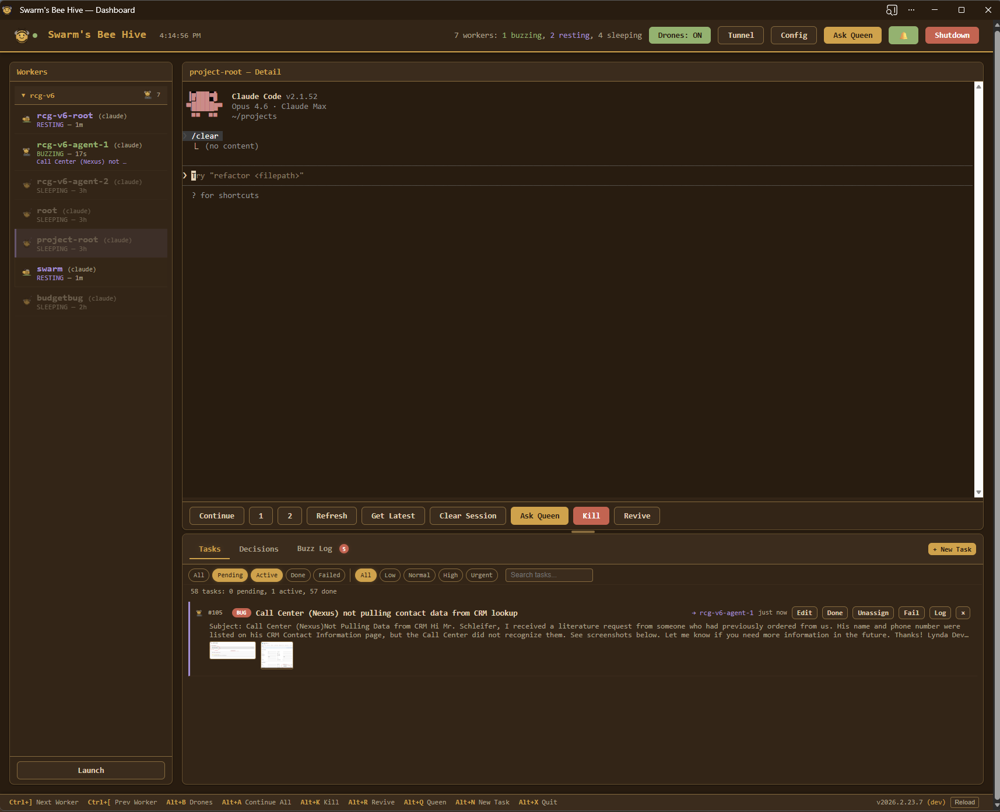
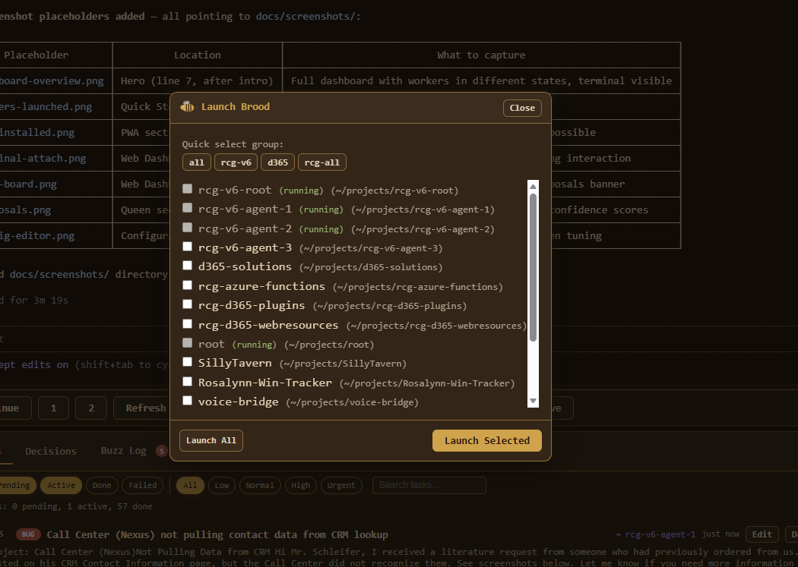
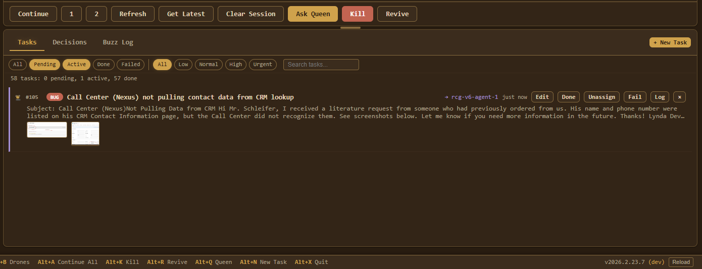
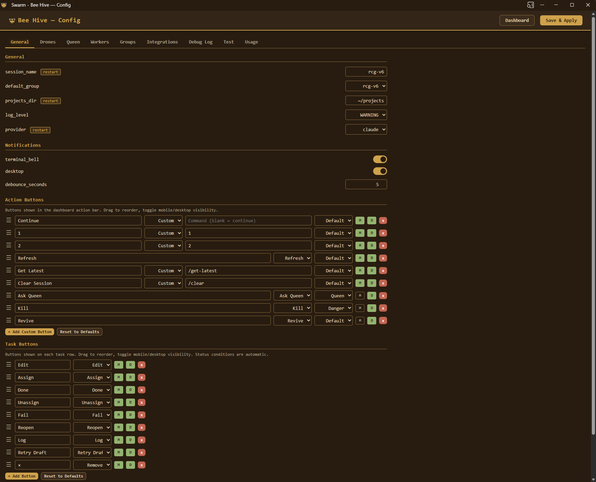

# Swarm

A web-based control center for AI coding agents — [Claude Code](https://docs.anthropic.com/en/docs/claude-code), [Gemini CLI](https://github.com/google-gemini/gemini-cli), and [Codex CLI](https://github.com/openai/codex). Manage one agent or ten from a single browser tab — with autopilot, a task board, AI coordination, and email integration.

Every agent session runs in a managed PTY. The **web dashboard** gives you real-time visibility into all of them: read their output, type into their terminals, create and assign tasks, and let background **drones** handle routine approvals so your agents never stall. A **Queen** conductor watches the hive, proposes task assignments, detects when work is done, and drafts email replies — all surfaced as proposals you approve with one click.



## Why Swarm

**Your agent sessions never stall.** Drones auto-approve safe prompts, revive crashed agents, and escalate decisions they can't handle. You stop babysitting and start reviewing results.

**You manage work, not windows.** Create tasks on a board. The Queen assigns them to the right worker based on project descriptions. When a worker finishes, the Queen detects it and proposes completion — you approve with one click.

**Your browser is the control room.** Interactive terminal attach lets you type directly into any worker's agent session from the dashboard. Drag an email onto the task board to create a bug ticket. When it's fixed, a draft reply lands in your Outlook.

**It works for one session too.** You don't need ten agents to benefit. Even a single agent session gets autopilot, a task queue, and a dashboard with terminal access.

## Features

**Web Dashboard** (primary interface)

- **Live terminal attach** -- type into any worker's agent session from the browser (PTY over WebSocket)
- **Task board** -- create, assign, track tasks with priority, filtering, and dependency support
- **Drag-and-drop email import** -- drop `.eml`/`.msg` files to create tasks; draft replies on completion
- **Queen proposals** -- approve or reject AI recommendations with confidence scores, one click or in bulk
- **Config editor** -- tabbed UI for workers, groups, drones, Queen, workflows, and integrations
- **Approval rules editor** -- visual regex rule builder for drone auto-approve/escalate decisions
- **Worker management** -- spawn ad-hoc workers, launch groups, kill/revive individuals, all at runtime
- **Outlook integration** -- connect via OAuth from the config page, fetch emails directly
- **Browser notifications** -- push alerts when workers need attention

**Autopilot**

- **Background drones** -- auto-approve prompts, revive crashed agents, escalate when stuck
- **Queen conductor** -- headless Claude that assigns tasks, detects completion, resolves conflicts
- **Proposal system** -- Queen actions require operator approval; nothing executes without your sign-off
- **Approval rules** -- regex patterns decide what drones auto-approve vs escalate to the Queen
- **Skill workflows** -- tasks dispatch as Claude Code skill commands (`/fix-and-ship`, `/feature`, `/verify`)

**Also included**

- **REST API** -- full JSON API with 50+ endpoints for programmatic control
- **YAML config** -- declarative config with workers, groups, descriptions, and tuning knobs
- **Notifications** -- terminal bell, desktop, and browser push alerts

## Requirements

- Python 3.12+
- [uv](https://docs.astral.sh/uv/)
- At least one AI coding agent CLI:
  - [Claude Code](https://docs.anthropic.com/en/docs/claude-code) (`claude`) — production-ready, also powers the Queen conductor
  - [Gemini CLI](https://github.com/google-gemini/gemini-cli) (`gemini`) — experimental
  - [Codex CLI](https://github.com/openai/codex) (`codex`) — experimental

## Installation

```bash
uv tool install git+https://github.com/bschleifer/swarm.git
```

This puts `swarm` on your PATH. No clone, no venv. Then run the setup wizard:

```bash
swarm init
```

This does four things:
1. **Installs Claude Code hooks** -- auto-approves safe tools (Read, Edit, Write, Glob, Grep) so workers don't stall on every file access
2. **Generates config** -- scans `~/projects` for git repos, lets you pick workers and define groups, writes to `~/.config/swarm/config.yaml`
3. **Installs background service** -- systemd user service (Linux/WSL) or launchd Launch Agent (macOS) that auto-starts the dashboard on boot and restarts on crash.
4. **Sets API password** -- optionally protects the web dashboard's config page from unauthorized changes

The dashboard is live at `http://localhost:9090` immediately after init. On WSL, a VBS auto-start script is placed in your Windows Startup folder so the full chain works unattended: **Windows boots → VBS wakes WSL → systemd starts → dashboard is ready.**

If a config already exists, `swarm init` offers three choices: **keep** the current config, **port** settings (carry over passwords, drone/queen tuning, notifications, etc. while refreshing workers from a new project scan), or start **fresh** (backs up the old config to `.yaml.bak`).

## Quick Start

The dashboard is already running after `swarm init`. Open it and launch your first workers:

1. Open `http://localhost:9090` (or the PWA if you installed it)
2. Click **Launch Brood** and select the workers or groups to start

Workers appear in real-time. Attach to any terminal, create tasks, and let drones handle the rest.



The dashboard auto-starts on boot — just open the app each day. You can also launch workers from the CLI with `swarm start` (see [CLI Reference](#cli-reference)).

## Install as App (PWA)

Installing the PWA is the recommended way to use Swarm -- it gives you a native-app experience with its own window and title bar.

- **Desktop** -- open `http://localhost:9090` in Chrome or Edge and click the install icon in the address bar

**Offline support:** a service worker caches the app shell. If the server restarts, the app auto-reconnects when it comes back.

**App badge:** the app icon shows a badge with the count of pending proposals (via the PWA Badge API).

## Web Dashboard

The web dashboard is the primary interface. It auto-starts on boot via systemd (Linux/WSL) or launchd (macOS) and connects via WebSocket for real-time updates. Open the PWA or visit `http://localhost:9090` (port configurable via `port` in swarm.yaml).

**What you get:**

- **Worker sidebar** -- live state indicators (BUZZING/RESTING/WAITING/STUNG), one-click continue/kill/revive
- **Interactive terminal** -- click "Attach" to open any worker's agent session in an in-browser terminal (full xterm.js PTY). Type commands, approve plans, interact directly.
- **Task board** -- filterable by status and priority, drag `.eml`/`.msg` files to create tasks, Queen proposals banner with approve/reject/approve-all
- **Config page** -- tabbed editor for workers (add/remove, edit descriptions), groups (CRUD), drones (approval rules builder), Queen (system prompt, confidence slider), workflows, and Microsoft Graph connection
- **Drone log** -- real-time feed of autopilot decisions and actions
- **Buzz log** -- notification history with browser push alerts



If `api_password` is set in the config (or `SWARM_API_PASSWORD` env var), config mutations require a Bearer token.

### Keyboard Shortcuts

The web dashboard supports keyboard shortcuts:

| Key | Action |
|-----|--------|
| `Ctrl+]` | Next worker |
| `Ctrl+[` | Previous worker |
| `Ctrl+Tab` / `Alt+]` | Cycle to next worker |
| `Shift+Ctrl+Tab` / `Alt+[` | Cycle to previous worker |
| `Alt+B` | Toggle drones |
| `Alt+A` | Continue all idle workers |
| `Alt+K` | Kill worker |
| `Alt+R` | Revive worker |
| `Alt+Q` | Ask Queen |
| `Alt+N` | New task |
| `Alt+X` | Quit |

## Task System

Tasks flow through a skill-based workflow pipeline. Each task type maps to a Claude Code slash command that handles the full pipeline — planning, execution, testing, and committing.

### Task Types and Workflows

| Type | Skill Command | Pipeline |
|------|---------------|----------|
| **Bug** | `/fix-and-ship` | Trace root cause → TDD fix → minimal patch → commit & push |
| **Feature** | `/feature` | Read patterns → implement → test → validate |
| **Verify** | `/verify` | Pull latest → run tests → verify behavior → report pass/fail |
| **Chore** | *(inline steps)* | Complete task → validate → commit |

Skill commands are configurable via the `workflows:` section in swarm.yaml. Set a value to empty to disable skill invocation for that type and fall back to inline instructions.

### Task Lifecycle

1. **Create** -- from the dashboard, CLI (`swarm tasks create`), or by dragging an email onto the task board
2. **Assign** -- Queen proposes an assignment (or operator assigns manually) → worker receives skill invocation. Tasks with `depends_on` are blocked until all dependency tasks are completed.
3. **Execute** -- worker's agent session runs the skill pipeline
4. **Complete** -- Queen detects idle worker, proposes completion with resolution summary → operator approves
5. **Reply** *(optional)* -- if the task came from an email, a draft reply is created in Outlook

Tasks also support file attachments — upload files via `POST /api/tasks/{id}/attachments` or the dashboard UI. Attached files are stored in `~/.swarm/uploads/` and linked to the task.

### Email-Sourced Tasks

Drag `.eml` or `.msg` files onto the task board to create tasks from emails. See [Email Integration](#email-integration) for setup, reply drafting, and token details.

## Queen & Proposals

The Queen is a headless Claude instance (`claude -p`) that observes the hive and recommends actions. All Queen actions go through the **proposal system** — the operator reviews and approves or rejects each one.

### What the Queen Does

- **Analyze workers** -- when drones escalate a stuck worker, the Queen assesses the situation and recommends an action (continue, send message, restart, or wait)
- **Assign tasks** -- matches idle workers to pending tasks based on descriptions and project context
- **Detect completion** -- monitors assigned workers for completion signals (commits, test results, "done" messages)
- **Draft email replies** -- generates professional replies for email-sourced tasks when completed

### Proposal Flow

```
Queen analyzes hive state
  → creates proposal (assignment, escalation, or completion)
  → proposal appears in dashboard with confidence score
  → operator approves or rejects
  → approved actions execute automatically
```

### Configuration

- **`queen.system_prompt`** -- custom instructions prepended to all Queen prompts (describe your team, projects, assignment rules)
- **`queen.min_confidence`** -- threshold (0.0–1.0) below which escalation actions become proposals instead of auto-executing
- **`queen.cooldown`** -- minimum seconds between Queen API calls (rate limiting)

Plans always require human approval regardless of confidence (confidence is forced to 0.0).

## Email Integration

Swarm integrates with Microsoft Graph to create tasks from Outlook emails and draft replies on completion.

### Setup

1. Register an Azure AD app with `Mail.ReadWrite` and `offline_access` permissions
2. Add `http://localhost:9090/auth/graph/callback` as a redirect URI
3. Configure in swarm.yaml:

```yaml
integrations:
  graph:
    client_id: "your-azure-app-client-id"
    tenant_id: "your-tenant-id"        # or "common" for multi-tenant
```

4. Connect from the Config page in the web dashboard (OAuth PKCE flow — no client secret needed)

### How It Works

- **Import**: drag `.eml`/`.msg` files onto the task board, or fetch directly from Outlook via the dashboard
- **Reply**: on task completion, the Queen drafts a 3–4 sentence professional reply and saves it to your Drafts folder (never auto-sends)
- **Tokens**: stored at `~/.swarm/graph_tokens.json`, auto-refreshed on expiry

## Remote Access

Swarm includes built-in Cloudflare Tunnel support for accessing the dashboard from a phone or remote machine — no port forwarding required.

```bash
swarm tunnel              # start tunnel on default port (9090)
swarm tunnel --port 8080  # custom port
```

The tunnel URL is also available from the dashboard toolbar (Tunnel ON/OFF toggle). Configure a named domain with `tunnel_domain` in swarm.yaml.

## Updating

The dashboard checks for updates automatically on startup and shows a banner when a new version is available — click **Update & Restart** to install it. You can also check manually from the dashboard footer.

From the CLI:

```bash
swarm update              # check for updates and install interactively
swarm update --check      # check only, don't install
uv tool upgrade swarm-ai  # or upgrade directly via uv
```

Your config (`swarm.yaml`) is never touched by upgrades.

## Service Management

`swarm init` handles service setup automatically (systemd on Linux/WSL, launchd on macOS). These commands are for manual overrides:

```bash
swarm install-service              # install/start the service
swarm install-service --uninstall  # remove it
systemctl --user status swarm      # check status
journalctl --user -u swarm -f     # stream service logs
```

**WSL prerequisite:** systemd must be enabled inside WSL. `swarm init` detects when it's not and offers to configure `/etc/wsl.conf` automatically (requires sudo). After enabling, restart WSL (`wsl --shutdown` from PowerShell) and re-run `swarm init`.

## CLI Reference

| Command | Description |
|---------|-------------|
| `swarm start [target]` | Launch workers + web dashboard + open browser |
| `swarm launch <target>` | Start workers (group name, worker name, number, or `-a`) |
| `swarm serve` | Run web dashboard in foreground |
| `swarm status` | One-shot status check of all workers |
| `swarm send <target> <msg>` | Send a message to a worker, group, or `all` |
| `swarm kill <worker>` | Kill a worker's PTY process |
| `swarm tasks <action>` | Manage tasks (`list`, `create`, `assign`, `complete`) |
| `swarm web start\|stop\|status` | Manage web dashboard as background process |
| `swarm daemon` | Headless daemon with REST + WebSocket API |
| `swarm init` | Set up hooks, config, background service, and API password |
| `swarm update` | Check for and install updates from GitHub |
| `swarm validate` | Validate config |
| `swarm install-hooks` | Install Claude Code auto-approval hooks |
| `swarm install-service` | Install/manage systemd background service |
| `swarm check-states` | Diagnostic: show current worker states from PTY ring buffer |
| `swarm test` | Run supervised orchestration tests — scaffolds a synthetic project, auto-resolves proposals, and generates an AI-powered report to `~/.swarm/reports/` |
| `swarm tunnel [--port N]` | Start Cloudflare Tunnel for remote HTTPS access |

### Global Flags

| Flag | Env Var | Description |
|------|---------|-------------|
| `-c <path>` | | Config file path |
| `--log-level <LEVEL>` | `SWARM_LOG_LEVEL` | Logging verbosity (`DEBUG`, `INFO`, `WARNING`, `ERROR`) |
| `--log-file <path>` | `SWARM_LOG_FILE` | Log to file |
| `--version` | | Show version and exit |

## Environment Variables

| Variable | Description |
|----------|-------------|
| `SWARM_SESSION_NAME` | Override the session name |
| `SWARM_WATCH_INTERVAL` | Override the poll interval (seconds) |
| `SWARM_DAEMON_URL` | Connect to a remote daemon URL |
| `SWARM_API_PASSWORD` | Set API password (alternative to config file) |
| `SWARM_DEV` | Switch installed binary to dev mode (`1` = auto-detect source, or path to source root). Re-invokes via `uv run`, skips update checks, serves web assets from source tree. |
| `SWARM_LOG_LEVEL` | Override log verbosity (`DEBUG`, `INFO`, `WARNING`, `ERROR`) |
| `SWARM_LOG_FILE` | Log to file (path) |

Environment variables override the corresponding config file values.

## Configuration

All settings are managed from the web dashboard at `/config` — a tabbed editor for workers, groups, drones, Queen, workflows, and integrations. Changes save directly to your config file and take effect immediately.



`swarm init` generates the initial config at `~/.config/swarm/config.yaml`. You can also create `swarm.yaml` in your project directory. Config is loaded from (first match wins):

1. Explicit `-c /path/to/config.yaml`
2. `./swarm.yaml` in the current directory
3. `~/.config/swarm/config.yaml`

### Full Example

```yaml
session_name: swarm
projects_dir: ~/projects
port: 9090                             # web UI / API server port
provider: claude                       # global default: claude | gemini | codex
watch_interval: 5                      # seconds between poll cycles
log_level: WARNING                     # DEBUG, INFO, WARNING, ERROR

workers:
  - name: api
    path: ~/projects/api-server
    description: "NestJS API — handles auth, users, and billing"
  - name: web
    path: ~/projects/frontend
    description: "Next.js dashboard — admin UI, reports, settings"
    provider: gemini                   # per-worker override (experimental)
  - name: tests
    path: ~/projects/test-suite

groups:
  - name: default
    workers: [api, web]
  - name: all
    workers: [api, web, tests]

default_group: default                 # auto-launched when no target specified

drones:
  enabled: true
  poll_interval: 5.0                   # seconds between polls
  poll_interval_buzzing: 0.0           # override for BUZZING (0 = 2× base)
  poll_interval_waiting: 0.0           # override for WAITING (0 = base)
  poll_interval_resting: 0.0           # override for RESTING (0 = 3× base)
  sleeping_poll_interval: 30.0         # interval for SLEEPING workers
  auto_approve_yn: false               # auto-approve Y/N prompts
  max_revive_attempts: 3               # revives before giving up
  escalation_threshold: 120.0          # seconds idle before escalating to Queen
  max_poll_failures: 5                 # consecutive failures before circuit breaker
  max_idle_interval: 30.0              # max backoff interval when idle
  auto_stop_on_complete: true          # stop drones when all tasks complete
  auto_approve_assignments: true       # drones auto-approve Queen task assignments
  idle_assign_threshold: 3             # seconds idle before proposing assignment
  auto_complete_min_idle: 45.0         # seconds idle before proposing completion
  allowed_read_paths:                  # Read() auto-approved for these paths
    - ~/.swarm/uploads/
  approval_rules:
    - pattern: \bplan\b                # plans always escalate to operator
      action: escalate
    - pattern: "delete|remove|drop"    # destructive actions escalate
      action: escalate
    - pattern: ".*"                    # everything else auto-approved
      action: approve

queen:
  enabled: true
  cooldown: 30.0                       # min seconds between Queen invocations
  min_confidence: 0.7                  # below this, proposals require approval
  max_session_calls: 20                # API calls before rotating session
  max_session_age: 1800.0              # seconds before rotating session (30 min)
  system_prompt: |
    You coordinate agents working across our codebase.
    Match tasks to workers by project path. Never assign overlapping
    files to two workers on the same codebase.

workflows:
  bug: /fix-and-ship
  feature: /feature
  verify: /verify
  # chore: /my-custom-skill           # override chore workflow

integrations:
  graph:
    client_id: "your-azure-app-id"
    tenant_id: "your-tenant-id"

notifications:
  terminal_bell: true
  desktop: true
  debounce_seconds: 5.0

action_buttons:                        # dashboard action bar buttons
  - label: "Revive"
    action: revive                     # built-in: revive, refresh, queen, kill
    style: secondary                   # CSS class: secondary, queen, danger
  - label: "Ask Queen"
    action: queen
    style: queen
  - label: "Clear Session"
    command: /clear                    # custom: sends text to worker
    show_mobile: false                 # hide on mobile
  - label: "Get Latest"
    command: /get-latest
  - label: "Kill"
    action: kill
    style: danger

task_buttons:                          # task row action buttons
  - label: "Edit"
    action: edit                       # edit, assign, done, unassign, fail, reopen, log, retry_draft, remove
  - label: "Assign"
    action: assign
  - label: "Done"
    action: done
  - label: "Reopen"
    action: reopen

test:
  enabled: false
  port: 9091                           # separate port for test dashboard
  auto_resolve_delay: 4.0             # seconds before auto-resolving proposals
  report_dir: ~/.swarm/reports
  auto_complete_min_idle: 10.0

# api_password: "your-secret"         # protect config mutations
# tunnel_domain: my-swarm.example.com  # named Cloudflare tunnel domain
# log_file: ~/.swarm/swarm.log        # optional file logging
# daemon_url: http://localhost:9090    # dashboard connects via daemon API
```

### Notable Fields

- **`provider`** -- global AI provider (`claude`, `gemini`, `codex`). Claude is production-ready; Gemini and Codex are experimental stubs. Per-worker `provider` overrides the global default.
- **`workers[].description`** -- helps the Queen match tasks to workers; shown in dashboards
- **`default_group`** -- auto-launched when you run `swarm start` with no target
- **`drones.approval_rules`** -- regex pattern → action (`approve` or `escalate`) for choice menus
- **`queen.system_prompt`** -- custom operator instructions for the Queen (team context, assignment rules, confidence guidelines)
- **`workflows`** -- override skill commands per task type; set to empty to disable
- **`drones.poll_interval_buzzing/waiting/resting`** -- per-state poll interval overrides (set to `0` to use defaults derived from `poll_interval`: buzzing=2×, waiting=1×, resting=3×)
- **`drones.allowed_read_paths`** -- paths where Read() tool auto-approves without escalation
- **`drones.auto_complete_min_idle`** -- seconds a worker must be idle before Queen proposes task completion
- **`action_buttons`** -- customize the dashboard action bar (built-in actions or custom commands). Replaces the legacy `tool_buttons` field, which is still supported for backward compatibility.
- **`task_buttons`** -- customize the task row action buttons
- **`tunnel_domain`** -- custom domain for a named Cloudflare tunnel (leave empty for random subdomain)
- **`integrations.graph`** -- Azure AD app credentials for Outlook email integration

## REST API

The daemon exposes a JSON API on the same port as the web dashboard. All mutating `/api/` endpoints require an `X-Requested-With` header (CSRF protection).

### Endpoints

| Group | Routes | Description |
|-------|--------|-------------|
| **Health** | `GET /api/health` | Server status |
| | `GET /api/usage` | Token usage statistics (per-worker, queen, total) |
| **Workers** | `GET /api/workers`, `GET /api/workers/{name}` | List workers, worker detail |
| | `POST /api/workers/{name}/send`, `/continue`, `/kill`, `/revive`, `/escape`, `/interrupt`, `/analyze` | Worker actions |
| | `POST /api/workers/launch`, `/spawn`, `/continue-all`, `/send-all`, `/discover` | Bulk operations |
| **Drones** | `GET /api/drones/log`, `GET /api/drones/status` | Drone state |
| | `POST /api/drones/toggle`, `POST /api/drones/poll` | Drone control |
| **Tasks** | `GET /api/tasks`, `POST /api/tasks` | List / create tasks |
| | `POST /api/tasks/{id}/assign`, `/complete`, `/fail`, `/unassign` | Task lifecycle |
| | `PATCH /api/tasks/{id}`, `DELETE /api/tasks/{id}` | Edit / remove |
| | `POST /api/tasks/from-email`, `POST /api/tasks/{id}/attachments` | Email import, file upload |
| | `POST /api/tasks/{id}/reopen` | Reopen a completed or failed task |
| | `POST /api/tasks/{id}/retry-draft` | Retry email draft generation |
| | `GET /api/tasks/{id}/history` | Audit trail |
| **Proposals** | `GET /api/proposals` | List pending proposals |
| | `POST /api/proposals/{id}/approve`, `/reject` | Approve / reject |
| | `POST /api/proposals/reject-all` | Bulk reject |
| | `GET /api/decisions` | Proposal history / audit trail |
| **Queen** | `POST /api/queen/coordinate` | Trigger hive coordination |
| | `GET /api/queen/queue` | Queen call queue status (running/queued counts) |
| **Groups** | `POST /api/groups/{name}/send` | Broadcast to group |
| **Config** | `GET /api/config`, `PUT /api/config` | Read / update config |
| | `POST /api/config/workers`, `DELETE /api/config/workers/{name}` | Worker CRUD |
| | `POST /api/config/groups`, `PUT /api/config/groups/{name}`, `DELETE /api/config/groups/{name}` | Group CRUD |
| | `POST /api/config/workers/{name}/save` | Save a running worker to config |
| | `POST /api/config/workers/{name}/add-to-group` | Add a worker to a group |
| | `GET /api/config/projects` | Scan for projects |
| **Tunnel** | `POST /api/tunnel/start`, `/stop`, `GET /api/tunnel/status` | Remote access |
| **Session** | `POST /api/session/kill`, `POST /api/server/stop` | Shutdown |
| | `POST /api/server/restart` | Restart the server |
| **Files** | `POST /api/uploads` | File upload |
| **WebSocket** | `GET /ws` | Live event stream (workers, tasks, drones, proposals) |
| | `GET /ws/terminal` | Interactive terminal attach (PTY bridge) |

**Auth:** Config-mutating endpoints (`PUT /api/config`, worker/group CRUD) require `Authorization: Bearer <api_password>` when `api_password` is set.

### Security

- All mutating `/api/` endpoints require an `X-Requested-With` header (CSRF protection)
- Rate limited at 60 requests/minute per client IP
- `api_password` protects config mutations via Bearer token (`Authorization: Bearer <password>`)

## Architecture

```
┌─────────────────────────────────────────────────────────┐
│  Web Dashboard (:9090)                                   │
│  interactive terminals · keyboard shortcuts              │
│  drag-and-drop email                                     │
├─────────────────────────────────────────────────────────┤
│  REST API + WebSocket          Proposals UI             │
├─────────────────────────────────────────────────────────┤
│  Background Drones             Queen Conductor           │
│  (poll → decide → act)         (headless claude -p)      │
│  approval rules · revive       analyze · assign · reply  │
├─────────────────────────────────────────────────────────┤
│  Task Board                    Email Integration         │
│  skill workflows               Microsoft Graph API       │
│  .eml/.msg import              OAuth PKCE · draft reply  │
├─────────────────────────────────────────────────────────┤
│  Notification Bus              Config (hot-reload)       │
├─────────────────────────────────────────────────────────┤
│  PTY Holder (sidecar)                                    │
│  ┌────────┐ ┌────────┐ ┌────────┐                       │
│  │ worker │ │ worker │ │ worker │  ...                   │
│  │  api   │ │  web   │ │ tests  │                       │
│  └────────┘ └────────┘ └────────┘                       │
└─────────────────────────────────────────────────────────┘
```

**Worker states:**
- **BUZZING** -- actively working (Claude is processing)
- **RESTING** -- idle, waiting for input (< 5 min)
- **SLEEPING** -- idle > 5 min (display-only); drones use `sleeping_poll_interval` (default `30s`) for reduced polling frequency
- **WAITING** -- blocked on a prompt (plan approval, choice menu, user question)
- **STUNG** -- exited or crashed

The PTY-over-WebSocket terminal bridge supports up to 20 concurrent sessions.

**Decision layers:**
1. **Hooks** -- per-worker Claude Code hooks for instant tool approvals
2. **Drones** -- background polling that auto-approves, revives, and escalates
3. **Queen** -- headless Claude for cross-worker coordination, task assignment, and email replies

## Testing

`swarm test` runs a supervised end-to-end orchestration test against a dedicated instance (port `9091` by default).

1. **Scaffolds a synthetic project** -- copies a fixture project to a temp directory and initializes a git repo with pre-loaded tasks from `tasks.yaml`
2. **Auto-resolves proposals** -- a TestOperator subscribes to new proposals, waits `auto_resolve_delay` seconds (default `4.0`), then asks the Queen to evaluate and approve or reject each one
3. **Generates an AI-powered report** -- computes aggregated stats (decision distribution, rule hits, state changes, latency, Queen confidence), runs a headless LLM for actionable suggestions (rule changes, threshold adjustments, uncovered patterns), and writes a markdown report with cross-run trend comparisons

Reports are saved as JSONL logs at `~/.swarm/reports/`. Configure via the `test:` section in swarm.yaml.

## Development

```bash
git clone https://github.com/bschleifer/swarm.git
cd swarm
uv sync                    # install dependencies
uv run swarm --help        # run CLI from source
uv run pytest tests/ -q    # run test suite
uv run ruff check src/     # linting
uv run ruff format src/    # formatting
```

## License

MIT
